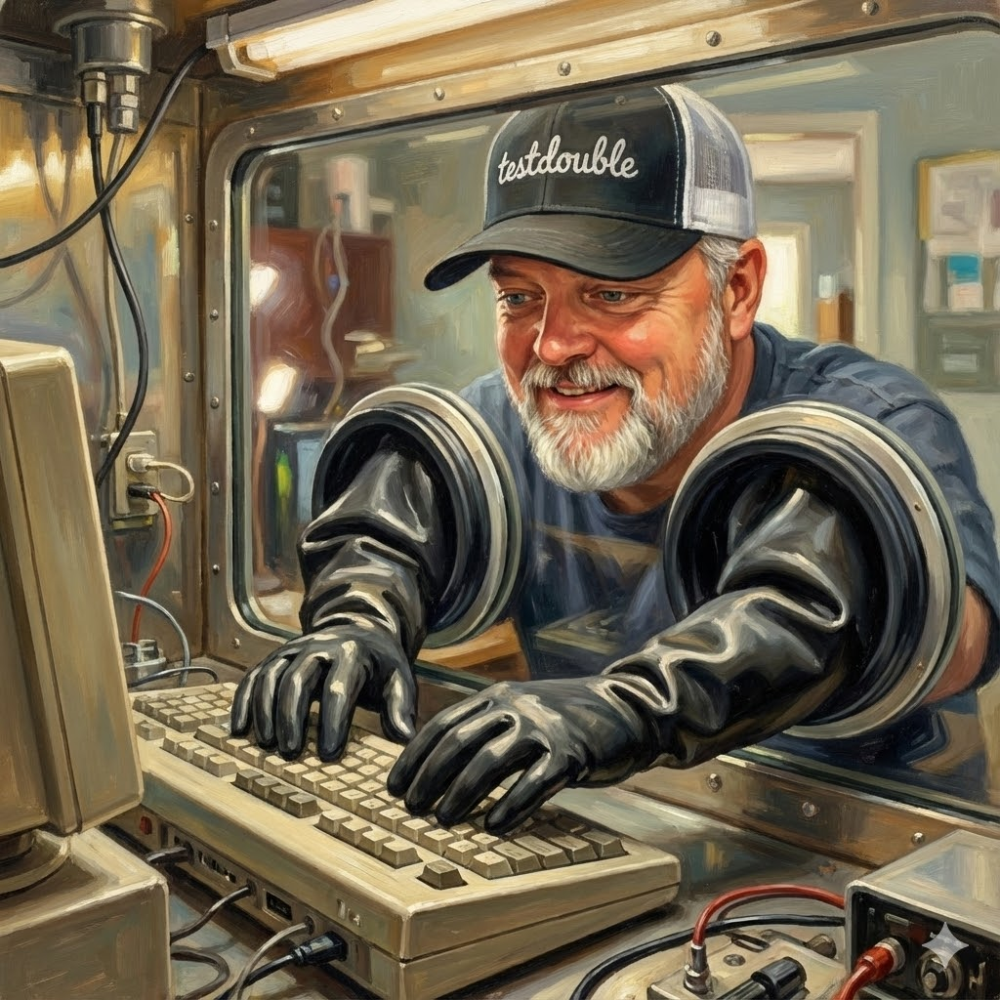

# Glovebox



A composable, dockerized development sandbox for working with dangerous things like agentic coding tools and npm packages.

## Why Glovebox?

AI coding assistants are powerful, but they run code. So do npm packages, pip installs, and that sketchy shell script you found on Stack Overflow. Running untrusted code on your development machine is a risk—but constantly spinning up VMs or fighting with container configs kills your flow.

Glovebox gives you a sandboxed Docker environment that actually feels like home. Your shell, your editor, your tools—all running safely inside a container with your project mounted. Think of it as glamping on Jurassic Island: even in mortal danger, you still get your Nespresso.

**What makes it different:**

- **Composable mods** - Mix and match shells, editors, languages, and AI tools
- **Layered images** - Build once, extend per-project
- **Persistent containers** - Your changes survive between sessions
- **Commit workflow** - Optionally save ad-hoc changes back to the image

## Prerequisites

- Docker
- Go 1.25+ (for building from source)

## Installation

### Homebrew (macOS/Linux)

```bash
brew tap joelhelbling/glovebox
brew install glovebox
```

This installs the `glovebox` command and a `gb` shorthand alias.

### From Source

```bash
git clone https://github.com/joelhelbling/glovebox.git
cd glovebox
make build
```

Then add the `bin` directory to your PATH, or install system-wide:

```bash
make install  # installs to /usr/local/bin with gb symlink
```

## Quick Start

```bash
# Create your base environment (one time setup)
glovebox init --base
glovebox build --base

# Run glovebox in any project directory
cd /path/to/your/project
glovebox run
```

## Architecture

Glovebox uses a **layered image approach**:

1. **Base Image (`glovebox:base`)**: Your standard development environment defined in `~/.glovebox/profile.yaml`. Contains your preferred shell, editor, and common tools. Build once, use everywhere.

2. **Project Images**: Optional project-specific extensions defined in `.glovebox/profile.yaml`. Extends the base image with additional tools needed for that project.

```
┌─────────────────────────────┐
│     Project Image           │  ← Project-specific tools
│  (glovebox:myproject-abc123)│     FROM glovebox:base
├─────────────────────────────┤
│     Base Image              │  ← Your standard environment
│     (glovebox:base)         │     Shell, editor, mise, etc.
├─────────────────────────────┤
│     Ubuntu 24.04            │
└─────────────────────────────┘
```

### Container Persistence

Each project gets its own persistent container. When you run glovebox:

1. **First run**: Creates a new container from your image
2. **Subsequent runs**: Starts the existing container (preserving all changes)
3. **On exit**: Detects filesystem changes and offers to commit them to the image

This means you can install tools, configure editors, and customize your environment during a session—then choose whether to persist those changes permanently.

```
$ exit

  ┃ Changes detected in container
  ┃
  ┃   A brew package: ripgrep
  ┃   A brew package: fd
  ┃   47 changes in /home/ubuntu
  ┃
  ┃ What would you like to do?
  ┃
  ┃   [y]es    commit changes to image (fresh container next run)
  ┃   [n]o     keep uncommitted changes (resume this container next run)
  ┃   [e]rase  discard changes (fresh container next run)
  ┃
  ┃ Choice: y
  ┃ ✓ Changes committed to glovebox:myproject-abc123
```

## Design Philosophy

Glovebox balances two concerns:

1. **Declarative base** - Mods in your profile define your standard environment, baked into images at build time
2. **Flexible runtime** - Ad-hoc changes during sessions can be committed back to the image

| What | How | When |
|------|-----|------|
| Shells, editors, tools | Mods in profile | Build time |
| Language runtimes | Mise (via mod) | Build time |
| Ad-hoc installs | Commit workflow | Runtime |
| Your code | Mounted from host | Always current |

**Source of truth:** Your profile defines what *should* be installed. The container's writable layer captures any runtime additions. If you clean everything and rebuild, you get exactly what your profile specifies.

## Commands

| Command | Description |
|---------|-------------|
| `glovebox init --base` | Create base profile (~/.glovebox/profile.yaml) |
| `glovebox init` | Create project-specific profile (.glovebox/profile.yaml) |
| `glovebox add <mod>` | Add a mod to your profile |
| `glovebox remove <mod>` | Remove a mod from your profile |
| `glovebox build --base` | Build the base image from base profile |
| `glovebox build` | Build project image (or base if no project profile) |
| `glovebox build --generate-only` | Only generate Dockerfile, don't build |
| `glovebox status` | Show profile, image, and container status |
| `glovebox run [directory]` | Run glovebox container |
| `glovebox clone <repo>` | Clone a repo and start glovebox in it |
| `glovebox clean` | Remove project container and image |
| `glovebox clean --all` | Remove all glovebox containers and images |
| `glovebox mod list` | List all available mods (alias: `ls`) |
| `glovebox mod cat <id>` | Output a mod's raw YAML to stdout |
| `glovebox mod create <name>` | Create a new custom mod from template |

## Composable Mods

Glovebox uses a mod-based system to compose your development environment:

```
$ glovebox mod list

  ┃ Available Mods
  ┃
  ┃ core/
  ┃   base         Core dependencies required by all glovebox environments
  ┃
  ┃ shells/
  ┃   bash         Bash shell (default, minimal configuration)
  ┃   fish         Fish shell - the friendly interactive shell
  ┃   zsh          Z shell with sensible defaults
  ┃
  ┃ tools/
  ┃   homebrew     The Missing Package Manager for macOS (or Linux)
  ┃   mise         Polyglot runtime version manager
  ┃   tmux         Terminal multiplexer with tmuxp session manager
  ┃
  ┃ editors/
  ┃   emacs        GNU Emacs - the extensible text editor
  ┃   helix        Helix - a post-modern modal text editor
  ┃   neovim       Neovim - hyperextensible Vim-based text editor
  ┃   vim          Vim - the ubiquitous text editor
  ┃
  ┃ languages/
  ┃   nodejs       Node.js JavaScript runtime (LTS)
  ┃
  ┃ ai/
  ┃   claude-code  Anthropic's Claude Code CLI assistant
  ┃   gemini-cli   Google's Gemini CLI assistant
  ┃   opencode     OpenCode AI coding assistant
```

## Workflow

### Initial Setup (One Time)

```bash
# Create your base environment with your preferred tools
glovebox init --base

# Build the base image
glovebox build --base
```

### Daily Use

```bash
# Run glovebox in any project directory
cd ~/projects/my-app
glovebox run
```

### Project-Specific Tools

If a project needs additional tools not in your base image:

```bash
cd ~/projects/special-project

# Create a project profile
glovebox init

# Add project-specific mods
glovebox add languages/python

# Build and run
glovebox build
glovebox run
```

### Ad-hoc Tool Installation

Need something not in your profile? Just install it:

```bash
# Inside the container
brew install jq

# On exit, glovebox detects the change
exit
# "Persist these changes to the image? [y/N]"
```

If you say yes, the change is committed to your image. If you say no, the change still persists in the container for next time—it just won't survive a `glovebox clean`.

## Environment Variables

Glovebox can pass through environment variables from your host to the container. Configure this in your profile with the `passthrough_env` field:

```yaml
# ~/.glovebox/profile.yaml (or .glovebox/profile.yaml)
version: 1
mods:
  - base
  - shells/zsh
passthrough_env:
  - ANTHROPIC_API_KEY
  - OPENAI_API_KEY
  - GITHUB_TOKEN
  - MY_CUSTOM_VAR
```

Variables from both global and project profiles are merged, so you can define common ones globally and add project-specific ones as needed. When entering a new container, glovebox displays which variables are being passed through:

```
  ┃ glovebox
  ┃
  ┃ Workspace   ~/projects/my-app
  ┃ Image       glovebox:my-app-abc1234
  ┃ Container   glovebox-my-app-abc1234 (new)
  ┃ Env         ANTHROPIC_API_KEY, GITHUB_TOKEN
```

Only variables that are actually set in your host environment are passed through.

## Creating Custom Mods

Custom mods can be placed in two locations:

| Location | Scope | Path |
|----------|-------|------|
| Project-local | Only this project | `.glovebox/mods/<name>.yaml` |
| User base | All your projects | `~/.glovebox/mods/<name>.yaml` |

Local mods take precedence over embedded ones, so you can override built-in mods if needed.

### Mod Structure

Create a YAML file with the following structure:

```yaml
name: my-tool
description: My custom tool configuration
category: custom
requires:
  - base  # dependencies on other mods

apt_repos:
  - ppa:some/repo  # APT repositories to add

apt_packages:
  - some-package  # APT packages to install

run_as_root: |
  # Shell commands to run as root
  curl -fsSL https://example.com/install.sh | bash

run_as_user: |
  # Shell commands to run as the ubuntu user
  echo "setup complete"

env:
  MY_VAR: value  # Environment variables to set

user_shell: /usr/bin/bash  # Set as default shell (optional)
```

### Examples

**Add to your base image** (available everywhere):
```bash
mkdir -p ~/.glovebox/mods/custom
# Create ~/.glovebox/mods/custom/my-tool.yaml
glovebox add custom/my-tool
glovebox build --base
```

**Add to a project** (only for this project):
```bash
mkdir -p .glovebox/mods/custom
# Create .glovebox/mods/custom/my-tool.yaml
glovebox add custom/my-tool
glovebox build
```

**Override a built-in mod** (e.g., customize neovim):
```bash
# Copy the built-in mod as a starting point
mkdir -p ~/.glovebox/mods/editors
glovebox mod cat editors/neovim > ~/.glovebox/mods/editors/neovim.yaml

# Edit to customize, then rebuild
glovebox build --base
```

## File Locations

| File | Purpose |
|------|---------|
| `~/.glovebox/profile.yaml` | Global profile (base image definition) |
| `~/.glovebox/Dockerfile` | Generated base Dockerfile |
| `~/.glovebox/mods/` | Custom global mods |
| `.glovebox/profile.yaml` | Project profile (extends base) |
| `.glovebox/Dockerfile` | Generated project Dockerfile |
| `.glovebox/mods/` | Custom project mods |

## Roadmap

Features under consideration:

- **Dotfiles integration** - Automatically sync your dotfiles into the container
- **SSH key forwarding** - Securely access your SSH keys for git operations
- **Networking affordances** - Connect to host services (Ollama, LM Studio) and other containers
- **GPU passthrough** - Access host GPU for local AI model inference
